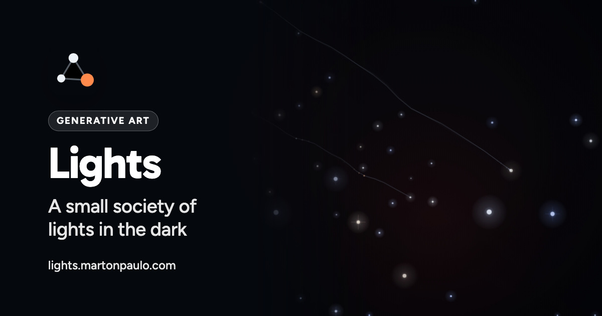

<div align="center">



# Lights

A dark field where forty points of light drift, bond, age and speak, so watching it rewards attention instead of asking for it.

[](https://github.com/martonpaulo/lights/actions/workflows/validate.yml) [](https://github.com/martonpaulo/lights/actions/workflows/browser-acceptance.yml) [](https://nodejs.org) [](https://playwright.dev)

</div>

Each light is a person with a temperament: how steady it is, how much company it wants, how hard it
feels what happens to it. **They drift together, fall out, grow old and fade in the dark, and speak
when you touch one.** Some carry a divergent trait — restless, single-minded, easily overwhelmed,
self-regulating — and all of it is simulated, so what a light does can be traced to what happened to
it.

It is **one HTML file with no build step and no dependencies**: markup, one `<style>` block and one
`<script>`. Everything runs in your browser, speech uses only the voices your own system synthesises
locally, and the only thing ever stored is your three volume levels.

<br />

---

## 🌱 Quick Start

No build, no dependencies. Serve the folder over HTTP so the audio loads:

```bash
python3 -m http.server 8000
```

Then open <http://localhost:8000>. Sound starts only after you interact with the page.

## 🛠 Commands

There is no package manifest and no install step. Every command below is optional tooling, never a
dependency of the page.

| Command | What it does |
|---|---|
| `node --test` | The regression suite in `tests/`, which loads the real `index.html` through `tests/harness.js`. Nothing to install |
| `node -e "const s=require('fs').readFileSync('index.html','utf8');new Function(s.match(/<script>([\s\S]*?)<\/script>/)[1]);console.log('OK')"` | Checks that the embedded script still parses |
| `npm install --no-save playwright@1.63.0 && npx playwright install --with-deps` | Installs the acceptance tooling on demand |
| `node tests/browser/acceptance.mjs` | Acceptance in all three engine families. Pass `chromium`, `firefox` or `webkit` to run just one |
| `node scripts/social-card.mjs` | Renders `social-card.jpg` from `design/social-card/social-card.html` at exactly the 1200x630 the meta tags declare |
| `python3 -m http.server 8000` | Serves the page locally |

Both halves of the suite run in CI, each gated to the paths it can actually observe: `validate.yml`
watches `index.html` and `tests/**`, and `browser-acceptance.yml` watches `index.html` and
`tests/browser/**`, with the Playwright version pinned so a cache hit always means the same browser
builds.

## 🔐 Secrets and variables

**This project has none.** There is no backend, account, build step, dependency, signing identity,
environment variable or GitHub Actions secret — publication is a push to `main`, and neither
workflow reads anything but the checked-out files. Every repository file is served publicly by
GitHub Pages, so credentials and private data must never be added to the project.

## What happens in there

- **Energy** runs from −1 to +1 and drifts with experience. Opposites attract, like repels like, and
  the colour of a light is its charge.
- **Relationships** accumulate. Time spent close counts for or against depending on whether two fit,
  a hard collision is remembered as an offence, and every light settles on a closest friend and a
  rival it steers toward and away from.
- **Experience changes behaviour.** Each light trains a tiny online model from its own encounters,
  then approaches people it expects to get along with and avoids those it does not.
- **Entanglement** starts from the unbound light that has waited longest, then pairs it with
  whichever free light scores highest on a mix of distance and its own waiting time. Bound pairs
  flicker in antiphase and pass each other mirrored impulses across the field.
- **Lives end.** A light ages a year every fourteen seconds, changes personality as it passes
  through its stages, and eventually fades. Its place stays empty a while before someone new arrives
  with a fresh name and history.
- **The field is read back** as a society every half minute: polarised, fragmented, crowded, feuding,
  learning, or settling into clusters found by k-means.

## Using it

| Gesture | What it does |
| --- | --- |
| Click a light | Selects it and lets it speak |
| Cmd + click (Ctrl + click on Windows and Linux) | Holds a second one; the two answer each other |
| Click empty space | Detonates there — click again to stack the blast |
| Right-click (Ctrl + click on macOS) | Summons a comet, a portal pair or an attractor at that point |
| Drag | Moves a light or a summon |
| Escape | Clears the selection |

Everything above is reachable without a pointer. Tab moves into the field, then:

| Key | What it does |
| --- | --- |
| Arrow keys | Move the cursor between lights and summons |
| Enter | Selects the light under the cursor |
| Shift + Enter | Holds a second one, or lets a held one go |
| Shift + arrow keys | Moves the light or summon under the cursor |
| S | Opens the summon list at the cursor |
| B | Detonates at the cursor |
| Escape | Closes the summon list, or clears the selection |

The field announces what the cursor is on, so a screen reader reads out the light's personality,
name, age and whether it is selected. Tab continues out of the field into the audio controls. In
Safari, reaching the buttons and sliders with Tab needs **Settings → Advanced → Press Tab to
highlight each item**, which is that browser's own default rather than something this page sets.

Sound starts only after you interact, and the panel controls music, voices and effects separately.
Levels persist in your browser.

## Requirements

A current browser with Canvas 2D, Web Audio and Web Speech. Only voices your operating system
synthesises locally are used, so no line ever leaves your machine; network-backed voices such as
Chrome's Google voices are deliberately skipped. On macOS the Enhanced and Premium system voices
sound markedly better than the compact ones. Without a local English voice the lines are still
written on screen and the piece simply stays silent.

## Social card

The link-preview card is generated from `design/social-card/social-card.html`, whose sky is a real
frame of the piece. The HTML stays the source; `social-card.jpg` is written from it by
`node scripts/social-card.mjs` and is never edited by hand.

## Privacy

Everything runs in your browser. Nothing is sent anywhere, there is no analytics, no account and no
server. The only thing stored is your three volume levels, in `localStorage`.

## Contributing

Bug reports, ideas and patches are welcome: see [CONTRIBUTING.md](CONTRIBUTING.md). The working
agreements for this repository — its patterns, test ownership and Git policy — are in
[AGENTS.md](AGENTS.md).

## Limitations

- Speech quality depends entirely on the local English voices your system has installed, and there
  may be none.
- English only. The written lines are the work, and translating them would produce a different piece.
- Tuned for a desktop-sized window; it runs on a phone but the field gets crowded.
- The world nearly pauses while the tab is hidden, because the browser throttles its timer, and it
  resumes without compensating for the time that passed.
- Node tests do not substitute for the real-browser checks, and neither substitutes for human
  judgement on screen-reader behaviour, listening quality and comfort under reduced motion.

## License and attribution

[CC BY 4.0](LICENSE) © 2026 Marton Paulo.

The background track is "Space ambient mix.mp3" by Almusic34, also CC BY 4.0, via the [Free Music Archive](https://freemusicarchive.org/music/almusic34/single/space-ambient-mixmp3).

Third-party notices in [NOTICE.md](NOTICE.md).
